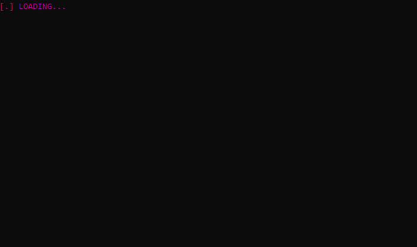

# NOK-raise

A terminal app that automates tasks on network devices like routers, switches and network termination equipments (NTE).
The script executes commands on devices, data are extraced and processed in order to find the neighboring devices.

Various information are displayed in the running time, as below.



## Usage example

The script is executed in a terminal with three parameters `username` `IP_address` `Vlan_ID`

```sh
42sh$ python3 Node.py user1 10.170.1.2 2626
```

[View the whole output](Annex/check_done_10.170.1.2_2626.txt)

## Notable features

* Automating test on routers, switches, NTE from CISCO, HUAWEI, RAD
* Configuration errors are raised
   * `WARNING! VLAN <Vlan_ID> does not exist on <Hostname>`
   * `WARNING! No flow related to vlan <Vlan_ID> found on the Rad`
   * `Check on <Hostname> -> <IP@> failed`
* Showing the output of STP and MPLS commands executed on each devices where the VLAN is configured.
* Showing information about port, IP destination

## What I learned

* Connecting to devices via SSH and Telnet using Pexpect and Python 3
* Processing data with Regex
* Data structures
  * Linked list
  * Queue
  * Stack
  * Binary Tree
